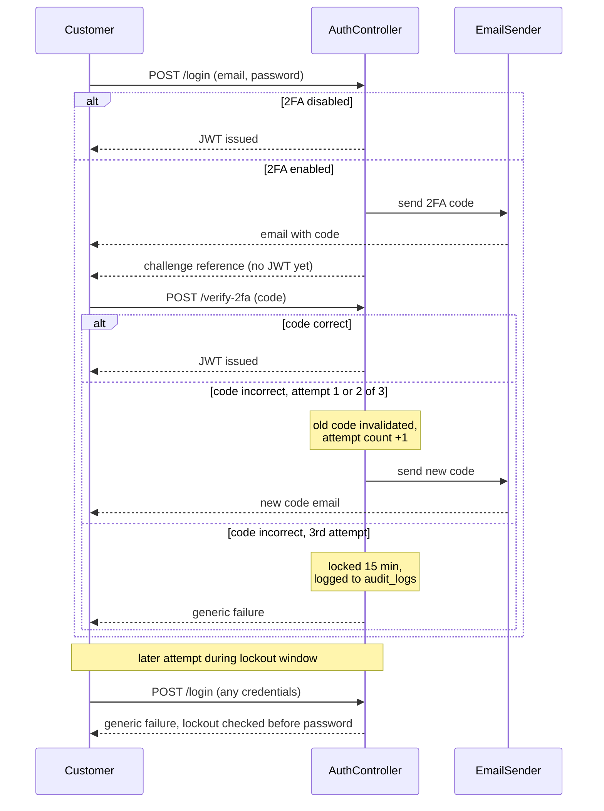

# Login / 2FA sequence

Captures the design worked through for `FR-33`/`FR-34` (see `subscribe_master_requirements.md` for the formal requirements and `IMPLEMENTATION_BACKLOG.md` for wave placement — this diagram remains the detailed design reference). Covers: password check, the 2FA challenge, the retry-with-new-code behavior on a wrong guess, and the lockout after the 3rd failed attempt.

## Key decisions this diagram encodes

- **Password is checked first, always.** 2FA is a genuine second factor, not a first gate — confirmed after an earlier draft of this flow had the order reversed.
- **The first code send is a side effect of a successful `/login`, not its own endpoint.** There's no standalone "send code" call.
- **A wrong code immediately invalidates itself and triggers an automatic resend** — not a customer-initiated resend action. Only the 3rd wrong attempt breaks this cycle.
- **Lockout duration: 15 minutes.** Chosen as a middle ground — long enough to meaningfully slow a scripted attack, short enough that a customer who fat-fingered their code isn't locked out for an unreasonable stretch.
- **The failure message is identical whether the password was actually correct or not, whenever the account is locked.** This is deliberate: telling a locked-out attacker "your password was right, but..." would leak that their password guess was valid, even while blocking further attempts.
- **The lockout check happens before password validation** on any subsequent `/login` attempt during the lockout window — so a locked-out account behaves identically regardless of what password is submitted.

## Schema — not yet built

Neither of these exist yet; both land when `FR-33`/`FR-34` are actually implemented,
likely folded directly into `V1` given this project's still-pre-deployment consolidation
precedent (see `V1`'s own migration comment for why).

- **`customers.two_factor_enabled BOOLEAN NOT NULL DEFAULT TRUE`** — `FR-34`'s toggle target.
- **`customer_two_factor_codes`** — the OTP challenge record itself: code hash, expiry,
  attempt count. Exact columns to be finalized when `FR-33` is actually built.
