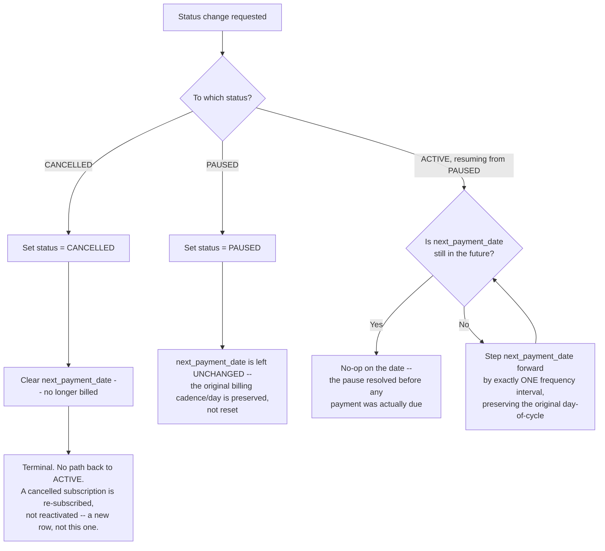

# Subscription status transitions and payment-date impact

Captures the design worked through for `FR-09`'s status transitions and their effect on
`next_payment_date` (`FR-08`). `task.pdf` names the three states (`ACTIVE`, `PAUSED`,
`CANCELLED`, via a sealed interface or enum) but says nothing about transition validity
or payment-date behavior — this is a genuine, deliberate gap in the spec, not something
missed. Per the evaluation criteria's own emphasis on "the ability to handle
uncertainty... situations that were not clearly stated" as the single most important
criterion, this doc exists to make that reasoning explicit rather than leave it implicit
in code.

## Key decisions this diagram encodes

- **Cancellation is terminal.** No transition path back to `ACTIVE` exists at the API
  level. Reactivating a cancelled subscription is treated as a new subscription (a new
  row), not a state change on the old one — avoids inventing a re-activation flow
  `task.pdf` never asked for. (Out of scope here, but worth noting: any future UI should
  add a confirmation step before committing this transition, since it's destructive and
  hard to undo.)

- **Pausing preserves the original billing cadence — it does not reset or clear
  `next_payment_date`.** The date stays exactly where it already was. This is the
  anchor the resume logic below depends on.

- **Resuming recalculates `next_payment_date` only if a scheduled payment was actually
  skipped during the pause.** If the customer resumes before the next payment was due,
  nothing changes — the pause had no billing consequence. This is deliberately
  date-dependent, not duration-dependent: a two-day pause and a two-week pause are
  treated identically if neither crosses an actual payment date.

- **When a cycle genuinely was skipped, the date is stepped forward ONE interval at a
  time, then rechecked — the diagram makes this explicit as a loop** (`K` steps
  forward once, then returns to `H`'s check), **rather than a hidden "step until done"
  inside a single box.** This preserves the customer's original billing day throughout:
  a subscription that always billed on the 1st keeps billing on the 1st after resuming
  — it doesn't start billing on whatever arbitrary day the customer happened to
  reactivate. This was a deliberate choice over the simpler alternative (reset from
  resume date), since it better matches how real subscription services behave and
  avoids silently drifting a customer's billing date without their action.

- **Multiple skipped cycles are handled by the same loop, not a special case.** If a
  subscription is paused through several payment dates, the `K → H` loop simply
  continues until the date lands in the future — no separate "long pause" branch
  needed. In code, this is naturally a `while` loop, not a single formula.
