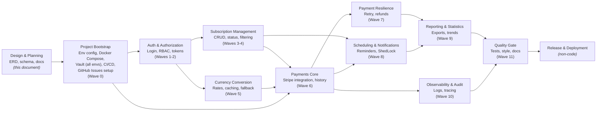

# Subscribe Master — Requirements (with Schema Coverage Status)

**A note on `task.pdf`:** this document is referenced throughout as the project's original jump-off point, but it is intentionally **not included in this repository**. It was a take-home assignment brief (with a 3–5 day deadline and an external evaluator) that no longer reflects this project's actual scope, timeline, or goals — this project has since grown well beyond it as a multi-domain learning exercise. Where `task.pdf` is cited below, it's for provenance (explaining why a requirement is numbered the way it is, or why a particular decision diverges from the original brief) — not as a claim that it's still an active specification. The current, authoritative scope is this document plus `ARCHITECTURE.md`.

## Overview

The diagram below is a high-level roadmap view of the project, grouped by domain area rather than by individual requirement. It's meant to orient a reader before the detailed FR/NFR tables below, and stays in sync with the wave structure in `IMPLEMENTATION_BACKLOG.md` — each box here corresponds to one or more waves there. Unlike the backlog, this includes non-code tasks (project bootstrap, release) alongside the implementation waves, since those aren't tracked as FR/NFR issues but still belong on the roadmap.

A few things this diagram intentionally does and doesn't show: it's domain-level, not requirement-level (48 individual FR/NFR boxes would be unreadable at this scale — see the backlog for that granularity); branches indicate things that can be worked in parallel (e.g. Subscription Management and Currency Conversion don't depend on each other, only on Auth); and it isn't a strict Gantt/timeline — it's a dependency map, so how long each box takes isn't represented. Project Bootstrap intentionally bundles everything that's one-time setup work with no real ordering dependency among its own parts (env config, Docker Compose, Vault provisioning for every environment, CI/CD, and creating the GitHub Issues from `IMPLEMENTATION_BACKLOG.md`) — splitting these into separate boxes would have implied a sequencing that doesn't actually exist between them.

Extracted from `task.pdf`. This version adds a **Status** column assessing whether each requirement is met **by the database schema** (`migrations/` — the versioned Flyway migration set — and `subscribe_master_erd.drawio`). Application-layer requirements (endpoints, business logic, libraries, code style, deployment) are marked **N/A** rather than "not met" — the schema can't satisfy those by definition, but where the schema provides the data model needed to support them, that's noted.

**FR-28, FR-29, NFR-17, NFR-18, NFR-19, and NFR-20 are supplementary** — they weren't extracted from `task.pdf`. `task.pdf` was used as a jump-off point for a broader project whose purpose is applying enterprise-level patterns across several domains, not as a fixed scope boundary — these six were deliberately added (partial refunds, payment retry/dunning, audit logging, request tracing, CI/CD, and Vault-based secrets management) because they're the kind of thing a real commercial subscription-billing system would need, and their absence from the source document reflects that document's narrower take-home scope, not that they're out of scope here. They're marked as such in their Notes column.

**Status legend:**
- ✅ **Met** — the schema fully supports this requirement
- ⚠️ **Partial** — the schema supports part of it, or supports it in a structurally different way than specified
- ❌ **Not Met** — a genuine schema gap
- ➖ **N/A** — this is an application/code-level concern, not a database design concern

---

As implementation begins, each functional and non-functional requirement in this document will be opened as an individual GitHub Issue, titled with its requirement ID for direct traceability back to this table (e.g. `[FR-01] User registration endpoint`). From that point forward, the GitHub Issue — not this document — is the live record of implementation status: issues are labeled by state (`not-started`, `in-progress`, `needs-tests`, `done`) and referenced directly in commits and pull requests (e.g. `Closes FR-01`), so status updates as a side effect of normal development rather than through manual edits here.

**Note:** This document reflects a pre-implementation design assessment — it records whether the database schema was ready to support each requirement before any application code existed. A "Met" status here means the data model does not block that requirement; it does not mean the requirement is functionally complete, tested, or deployed. This document is not updated further once an item's corresponding GitHub Issue is created — see the linked issue by requirement ID for live status instead.

---

## 1. Functional Requirements

| ID | Category | Requirement | Priority | Status | Notes |
|---|---|---|---|---|---|
| FR-01 | Auth & User Management | User registration (`/auth/register`) | Core | ➖ N/A | Application endpoint. `customers` table provides the needed storage. |
| FR-02 | Auth & User Management | User login (`/auth/login`) | Core | ➖ N/A | Application endpoint. `customers.password_hash` and `customer_sessions` support it. |
| FR-03 | Auth & User Management | Password hashing (BCrypt) | Core | ✅ Met | `customers.password_hash` / `staff_users.password_hash` are algorithm-agnostic `TEXT` columns; BCrypt itself is enforced by application code, not the schema. |
| FR-04 | Auth & User Management | Per-user data isolation | Core | ✅ Met | Every subscription row carries `customer_id`; access control is enforced via this FK. |
| FR-05 | Auth & User Management | Refresh token mechanism | Additional | ✅ Met | `customer_refresh_tokens` added, following the same hash-storage pattern as the password reset/email verification tables, but with `revoked_at` instead of `used_at` since refresh tokens are reusable until expiry or revocation, not single-use. An API-gateway/IdP-based alternative was considered and deliberately rejected as disproportionate to this "Additional" requirement's scope. |
| FR-06 | Auth & User Management | Role-based access (USER/ADMIN) | Additional | ⚠️ Partial | Implemented structurally differently: separate `customers` + `staff_users` tables with a full `roles`/`permissions` RBAC layer, rather than a single role field. Achieves the same outcome with more granularity, but diverges from the spec as literally written. |
| FR-07 | Subscription Management | Subscription fields (name, price, currency, start date, frequency) | Core | ✅ Met | All present on `customer_subscriptions`. |
| FR-08 | Subscription Management | Next payment date calculation | Core | ✅ Met | `next_payment_date` column exists; the calculation logic itself is application-level. |
| FR-09 | Subscription Management | Subscription status (ACTIVE/PAUSED/CANCELLED) | Core | ✅ Met | `CHECK` constraint and default updated to `('ACTIVE', 'CANCELLED', 'PAUSED')`, matching the spec's casing exactly — safe for a direct Java enum mapping. |
| FR-10 | Subscription Management | Pagination & filtering | Additional | ➖ N/A | Query/API-layer concern. Supporting indexes exist (`idx_customer_subscriptions_active`, `idx_customer_subscriptions_category`, `idx_customer_subscriptions_next_payment_date`) to keep filtered queries efficient. |
| FR-11 | Subscription Management | Soft delete | Additional | ✅ Met | `customer_subscriptions.deleted_at`. |
| FR-12 | Subscription Management | Payment history survives cancellation | Additional | ✅ Met | `payment_history.subscription_id` uses `ON DELETE RESTRICT`, combined with soft delete on the parent — history is never orphaned or lost. |
| FR-13 | Currency Conversion | Base currency tracking | Core | ✅ Met | `customers.base_currency`. |
| FR-14 | Currency Conversion | Real-time exchange rates (cbu.uz) | Core | ➖ N/A | External API integration is application-level. `exchange_rates` table exists to store what's retrieved. |
| FR-15 | Currency Conversion | Rate caching | Additional | ✅ Met | `exchange_rates` table serves this role directly. |
| FR-16 | Currency Conversion | Resilience / fallback (Circuit Breaker) | Additional | ➖ N/A | Resilience4j / circuit-breaker logic is application-level. Schema supports the fallback pattern — the most recent row in `exchange_rates` for a currency pair can always be queried if a live call fails. |
| FR-17 | Currency Conversion | Rate date transparency | Core | ✅ Met | `exchange_rates.fetched_at`, plus `payment_history.exchange_rate_applied` snapshots the rate actually used at payment time. |
| FR-18 | Scheduling | Daily payment-due check (cron) | Core | ➖ N/A | Scheduling logic is application-level (`@Scheduled`). `shedlock` (v2) and `notification_log` (v2) support running it safely. |
| FR-19 | Scheduling | User warning notification | Core | ✅ Met (v2) | `notification_log` table records each warning sent. |
| FR-20 | Scheduling | Notification strategy abstraction (Strategy pattern) | Additional | ➖ N/A | A code design pattern, not a schema concern. `notification_log.channel` (`log`/`email`) records which channel was used. |
| FR-21 | Scheduling | Scheduler concurrency safety (ShedLock) | Additional | ✅ Met (v2) | `shedlock` table added, matching the standard ShedLock schema. |
| FR-22 | Reporting | Export annual cost report (Excel/CSV) | Core | ➖ N/A | File generation is application-level (Apache POI). Underlying data (`customer_subscriptions`, `payment_history`) is available to build the report from. |
| FR-23 | Reporting | Report contents (name, monthly price, base-currency equivalent, annual total) | Core | ✅ Met | All derivable from `customer_subscriptions` joined with `payment_history`. |
| FR-24 | Statistics | Most expensive subscription | Core | ✅ Met | Derivable via a query against `customer_subscriptions.amount` / `payment_history.amount`. |
| FR-25 | Statistics | Total monthly spend | Core | ✅ Met | Derivable via aggregation over `payment_history`. |
| FR-26 | Statistics | Monthly cost trend (6/12 months, JSON) | Additional | ✅ Met | Derivable via a time-series query over `payment_history.paid_at`. |
| FR-27 | Statistics | Category grouping | Additional | ✅ Met (v2) | `customer_subscriptions.category` added, independent of `subscription_providers.category` so custom subscriptions can be grouped too. |
| FR-28 | Payments & Refunds | Partial refund support | Additional | ✅ Met | `refunds` table supports full or partial amounts (not required to equal the original `payment_history.amount`), a required free-text `reason` (e.g. `prorated_cancellation`, covering the mid-cycle-cancellation proration case), and `stripe_refund_id` for reconciliation against Stripe's own refund record. `payment_history.status` includes `partially_refunded` as a distinct outcome from a full `refunded`. **Not sourced from `task.pdf`** — added deliberately, since real subscription-billing systems need to handle mid-cycle cancellations gracefully; this is a realistic enterprise requirement the source document's narrower scope didn't happen to cover. |
| FR-29 | Payments & Refunds | Payment retry / dunning (up to 3 attempts) | Additional | ✅ Met | `payment_history` (one row per billing-cycle obligation) tracks `attempt_count` (capped at 3 via `CHECK`) and overall `status`; `payment_attempts` records each individual try, with its own `stripe_payment_intent_id`, `status`, and `failure_reason` (e.g. `card_declined`), so a failed charge can be retried without losing per-attempt detail. Retry *timing* (how long to wait between attempts) is intentionally not modeled — that's an application-level scheduling rule, not schema data. **Not sourced from `task.pdf`** — added deliberately; dunning logic is standard practice in any real payment system handling recurring billing, and is exactly the kind of enterprise pattern this project exists to practice. |

---

## 2. Non-Functional Requirements

| ID | Category | Requirement | Status | Notes |
|---|---|---|---|---|
| NFR-01 | Architecture | Layered architecture | ➖ N/A | Application code structure, not a database concern. |
| NFR-02 | Reliability | Global exception handling | ➖ N/A | Application-level (`@RestControllerAdvice`). |
| NFR-03 | Data Integrity | Transactional integrity | ⚠️ Partial | `@Transactional` demarcation is application-level, but the schema supports consistency via foreign key constraints (e.g. `ON DELETE RESTRICT` on `payment_history.subscription_id` and `refunds.payment_history_id`) that prevent orphaned financial records even outside a transaction boundary. |
| NFR-04 | Data Integrity | Optimistic locking | ✅ Met (v2) | `version INTEGER NOT NULL DEFAULT 0` added to `customer_subscriptions` and `payment_history`. |
| NFR-05 | Performance | Exchange rate caching | ✅ Met | `exchange_rates` table. |
| NFR-06 | Maintainability | Code style (Google Java Style Guide) | ➖ N/A | Application code concern. |
| NFR-07 | Traceability | Auditing (created/modified timestamps) | ✅ Met | Every mutable table has both `created_at` and `updated_at`: added to `roles`, `permissions`, `customer_oauth_accounts`, and `customer_payment_methods`, which previously lacked full coverage. Intentionally excluded: `role_permissions` (a pure link table — no meaningful "update" to a junction row), and append-only tables (`audit_logs`, `app_logs`, `payment_attempts`, `refunds`, `exchange_rates`, `notification_log`), which only ever get `created_at` since adding `updated_at` would misleadingly imply they're ever mutated. |
| NFR-08 | Security / Configurability | Environment-based configuration | ➖ N/A | Deployment/config concern (`application-dev.yml` vs `application-prod.yml`), not a schema concern. |
| NFR-09 | Usability | API documentation (Swagger) | ➖ N/A | Application-level. |
| NFR-10 | Maintainability | Clean Code principles | ➖ N/A | Code quality concern, not schema. |
| NFR-11 | Testability | Minimum test coverage (30%) | ➖ N/A | Testing concern, not schema. |
| NFR-12 | Deployability | Single-command startup (Docker Compose) | ➖ N/A | Deployment concern, not schema. |
| NFR-13 | Maintainability | Managed database migrations (Liquibase) | ✅ Met (via Flyway) | The Tech Stack table (§3.1 of the source doc) lists Liquibase and Flyway as equally accepted tools, so this is a substitution, not a deviation. Flyway's own `flyway_schema_history` tracking table is intentionally excluded from the ERD as tool-internal infrastructure, not domain data — same treatment as `shedlock`. Delivered as versioned migration files under Flyway's naming convention (`V1__init_auth_and_authz.sql`, `V2__subscriptions_and_payments.sql`, etc.), plus one repeatable migration (`R__seed_subscription_provider_catalog.sql`) for catalog data that grows independently of schema changes. `migrations/` is the sole source of truth for the schema — no separate monolithic file. |
| NFR-14 | Maintainability / Testability | Constructor injection only | ➖ N/A | Application code concern. |
| NFR-15 | Performance | No N+1 queries (LAZY fetching) | ➖ N/A | ORM mapping configuration, not schema — though nullable foreign keys (e.g. `customer_subscriptions.payment_method_id`) don't force eager joins. |
| NFR-16 | Portability / Maintainability | No native SQL (JPQL/Specification API) | ➖ N/A | Query implementation choice, not schema design. |
| NFR-17 | Security / Compliance | Audit logging of actor actions | ✅ Met | `audit_logs` captures `actor_type`/`actor_id` (customer or staff, via the polymorphic reference discussed earlier), `action`, `resource`, `resource_id`, `ip_address`, and `created_at` — a queryable trail of who did what, to what, and when, for compliance and incident investigation. **Not sourced from `task.pdf`** — added deliberately; audit trails are a baseline expectation for enterprise/commercial software handling financial data and staff access, not an edge case. |
| NFR-18 | Observability | Distributed / request tracing | ✅ Met (v6) | `trace_spans` added (`span_id` PK, `trace_id` groups spans belonging to one request, self-referential `parent_span_id` for the span tree, `operation_name`, `service_name`, `status`, `started_at`, `duration_ms`). Kept separate from `app_logs` for the same reason `audit_logs` is separate from `app_logs` — different access pattern, different purpose. Uses `TEXT` rather than `UUID` for `trace_id`/`span_id` since standards like OpenTelemetry generate hex-encoded IDs that aren't valid UUIDs. **Not sourced from `task.pdf`** — added deliberately; distributed tracing is a standard observability practice in enterprise systems, and worth having modeled here even though the source document's narrower take-home scope didn't call for it. Like `app_logs`, this table is a candidate for living in a dedicated tracing backend (Jaeger, Zipkin, Tempo, or a hosted APM) rather than the primary database in a real production deployment — it satisfies the requirement at the schema level, but that infrastructure decision is separate. |
| NFR-19 | Deployability / DevOps | CI/CD pipeline for builds and deployment across all environments | ➖ N/A | Pure infrastructure/tooling concern (e.g. GitHub Actions, GitLab CI, Jenkins automating build, test, and deploy across dev/staging/prod) — a database schema can't satisfy this by definition. Indirectly well-supported by design choices already made: the schema is delivered as versioned and repeatable Flyway migrations under `migrations/`, which is specifically the format a CI/CD pipeline needs to run migrations automatically and consistently per environment, rather than requiring manual `psql` runs. **Not sourced from `task.pdf`** — added deliberately; a real CI/CD pipeline across environments is standard practice for enterprise/commercial software, and part of what this project exists to practice, not an incidental afterthought. |
| NFR-20 | Security / Configurability | Secrets management via HashiCorp Vault (all environments) | ➖ N/A | Pure infrastructure/tooling concern — application secrets (database password, Stripe API key, JWT signing key, etc.) are retrieved from Vault at runtime rather than stored in config files or environment variables directly. No schema impact: secrets are never persisted in any table by design, so this doesn't touch the database at all. Vault runs uniformly across every environment, including local development, not just staging/production — a deliberate choice to keep secret-retrieval behavior consistent everywhere rather than having local dev diverge from how staging/prod actually work. Distinct from NFR-08 (the general "don't hardcode secrets, use env profiles" principle) — this is the specific mechanism chosen to satisfy it, tracked separately for the same reason NFR-19 (CI/CD) got its own row rather than being folded into NFR-13. **Not sourced from `task.pdf`** — added deliberately as standard enterprise practice for secrets handling. |

---

## 3. Tracing gap — closed (v6)

Two paths were considered for closing NFR-18:

1. **Extend `app_logs` in place** — add `trace_id`, `span_id`, `parent_span_id`, and `duration_ms` columns. Minimal schema change, but conflates two different access patterns: audit-style point-in-time messages vs. high-volume request tracing.
2. **Dedicated `trace_spans` table** — `trace_id`, `span_id`, `parent_span_id` (nullable, for root spans), `operation_name`, `started_at`, `duration_ms`, `status`. Keeps `app_logs` focused on discrete log messages and `trace_spans` focused on request-path timing, mirroring the same separation-of-concerns reasoning already applied to `audit_logs` vs. `app_logs`.

**Option 2 was implemented** in `V6__tracing.sql`, for the reasons above — plus that trace data is typically high-volume and, like `app_logs`, a reasonable candidate for living in an external tracing backend in production rather than the primary database. That infrastructure decision is separate from the schema itself.

---

## 4. Summary

**Schema-level requirements fully met:** 24 of 25 requirements that are actually schema concerns (FR-03, FR-04, FR-07, FR-08, FR-09, FR-11, FR-12, FR-13, FR-15, FR-17, FR-19, FR-21, FR-23–29, NFR-04, NFR-05, NFR-07, NFR-13, NFR-17, NFR-18).

**Partial:** FR-06 (RBAC implemented differently than spec'd), NFR-03 (constraints help but transactions are app-level).

**Still open:** none at the schema level. FR-06 and NFR-03 remain Partial by design, not by gap — see their notes above.

**Recent updates:** FR-09 moved from Partial → Met after aligning the `status` CHECK constraint and default value casing (`'Active'` → `'ACTIVE'`, etc.) with the spec. NFR-13 moved from Not Met → Met on the decision to use Flyway (explicitly accepted alongside Liquibase in the source doc's Tech Stack table), packaged as versioned Flyway migration files. FR-05 moved from Not Met → Met with the addition of `customer_refresh_tokens`, after evaluating and deliberately rejecting an API-gateway-based alternative as disproportionate to this requirement's scope. NFR-07 moved from Partial → Met after adding `created_at`/`updated_at` to the four tables that were missing full timestamp coverage. NFR-17 added (audit logging, Met via the existing `audit_logs` table). FR-28 and FR-29 added (partial refunds and payment retry/dunning, both Met). NFR-18 added and then closed in the same review cycle — distributed tracing was a genuine gap, now Met via the new `trace_spans` table (`V6__tracing.sql`). NFR-19 added (CI/CD pipeline requirement) — correctly N/A at the schema level, but noted as already well-supported by the versioned-migration structure chosen for NFR-13. **Reorganization:** the ERD was consolidated from several versioned `.drawio` files down to a single canonical `subscribe_master_erd.drawio` with a color-coding legend; seed data was split out of `V1` into its own `V1.1__seed_roles_and_permissions.sql` (versioned, since it's foundational data coupled to the tables `V1` creates), and the subscription provider catalog seed was converted from a versioned `V5` migration into a repeatable `R__seed_subscription_provider_catalog.sql` (since that data grows independently over time). All superseded standalone SQL files were removed; `migrations/` is now the sole source of truth for the schema.

**Not applicable to schema:** the remaining ~20 requirements are endpoints, libraries, code patterns, testing, or deployment concerns that a database schema cannot satisfy on its own — most of them already have the supporting tables/columns/indexes in place for the application layer to build on.
