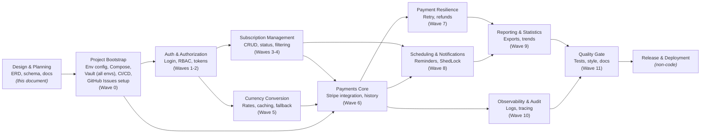

# Subscribe Master — Requirements (with Schema Coverage Status)

**A note on `task.pdf`:** this document is referenced throughout as the project's original jump-off point, but it is intentionally **not included in this repository**. It was a take-home assignment brief (with a 3–5 day deadline and an external evaluator) that no longer reflects this project's actual scope, timeline, or goals — this project has since grown well beyond it as a multi-domain learning exercise. Where `task.pdf` is cited below, it's for provenance (explaining why a requirement is numbered the way it is, or why a particular decision diverges from the original brief) — not as a claim that it's still an active specification. The current, authoritative scope is this document plus `ARCHITECTURE.md`.

## Overview

The diagram below is a high-level roadmap view of the project, grouped by domain area rather than by individual requirement. It's meant to orient a reader before the detailed FR/NFR tables below, and stays in sync with the wave structure in `IMPLEMENTATION_BACKLOG.md` — each box here corresponds to one or more waves there. Unlike the backlog, this includes non-code tasks (project bootstrap, release) alongside the implementation waves, since those aren't tracked as FR/NFR issues but still belong on the roadmap.

A few things this diagram intentionally does and doesn't show: it's domain-level, not requirement-level (48 individual FR/NFR boxes would be unreadable at this scale — see the backlog for that granularity); branches indicate things that can be worked in parallel (e.g. Subscription Management and Currency Conversion don't depend on each other, only on Auth); and it isn't a strict Gantt/timeline — it's a dependency map, so how long each box takes isn't represented. Project Bootstrap intentionally bundles everything that's one-time setup work with no real ordering dependency among its own parts (env config, Compose, Vault provisioning for every environment, CI/CD, and creating the GitHub Issues from `IMPLEMENTATION_BACKLOG.md`) — splitting these into separate boxes would have implied a sequencing that doesn't actually exist between them.

Extracted from `task.pdf`. This version adds a **Status** column assessing whether each requirement is met **by the database schema** (`migrations/` — the versioned Flyway migration set — and `subscribe_master_erd.drawio`). Application-layer requirements (endpoints, business logic, libraries, code style, deployment) are marked **N/A** rather than "not met" — the schema can't satisfy those by definition, but where the schema provides the data model needed to support them, that's noted.

**FR-28, FR-29, NFR-17, NFR-18, NFR-19, and NFR-20 are supplementary** — they weren't extracted from `task.pdf`. `task.pdf` was used as a jump-off point for a broader project whose purpose is applying enterprise-level patterns across several domains, not as a fixed scope boundary — these six were deliberately added (partial refunds, payment retry/dunning, audit logging, request tracing, CI/CD, and Vault-based secrets management) because they're the kind of thing a real commercial subscription-billing system would need, and their absence from the source document reflects that document's narrower take-home scope, not that they're out of scope here. They're marked as such in their Notes column.

**Status legend:**
- ✅ **Met** — the schema fully supports this requirement
- ⚠️ **Partial** — the schema supports part of it, or supports it in a structurally different way than specified
- ❌ **Not Met** — a genuine schema gap
- ➖ **N/A** — this is an application/code-level concern, not a database design concern

---

As implementation begins, each functional and non-functional requirement in this document will be opened as an individual GitHub Issue, titled with its requirement ID for direct traceability back to this table (e.g. `[FR-01] User registration endpoint`). From that point forward, the GitHub Issue — not this document — is the live record of implementation status: issues are labeled by state (`not-started`, `in-progress`, `needs-tests`, `done`) and referenced directly in commits and pull requests (e.g. `Closes FR-01`), so status updates as a side effect of normal development rather than through manual edits here.

**Note:** This document reflects a pre-implementation design assessment — it records whether the database schema was ready to support each requirement before any application code existed. A "Met" status here means the data model does not block that requirement; it does not mean the requirement is functionally complete, tested, or deployed. This document is not updated further once an item's corresponding GitHub Issue is created — see the linked issue by requirement ID for live status instead.

---

## 1. Functional Requirements

| ID | Category | Requirement | Priority | Status | Notes |
|---|---|---|---|---|---|
| FR-01 | Auth & User Management | User registration (`/auth/register`) | Core | ➖ N/A | Application endpoint. `customers` table provides the needed storage. Now served at `/api/v1/auth/register`, matching `NFR-25`'s versioning convention — retrofitted alongside `FR-02`'s login endpoint, since both share `AuthController` and were versioned together in one pass. |
| FR-02 | Auth & User Management | User login (`/api/v1/auth/login`) | Core | ➖ N/A | Application endpoint. `customers.password_hash` supports credential verification; the session itself is a signed JWT (RS256, Spring Security + JWT — matching task.pdf's literal requirement), not a database-backed table. See `V1`'s migration comment and `AuthService`'s class Javadoc for the fuller design history. |
| FR-03 | Auth & User Management | Password hashing (BCrypt) | Core | ✅ Met | `customers.password_hash` / `staff_users.password_hash` are algorithm-agnostic `TEXT` columns; BCrypt itself is enforced by application code, not the schema. |
| FR-04 | Auth & User Management | Per-user data isolation | Core | ✅ Met | Every subscription row carries `customer_id`; access control is enforced via this FK. |
| FR-05 | Auth & User Management | Refresh token mechanism | Additional | ✅ Met | `customer_refresh_tokens` added, following the same hash-storage pattern as the password reset/email verification tables, but with `revoked_at` instead of `used_at` since refresh tokens are reusable until expiry or revocation, not single-use. An API-gateway/IdP-based alternative was considered and deliberately rejected as disproportionate to this "Additional" requirement's scope. Note: FR-02's session-duration TODO (12h now, likely shortened to 1-2h once this lands) is waiting on this.|
| FR-06 | Auth & User Management | Role-based access (USER/ADMIN) | Additional | ⚠️ Partial | Implemented structurally differently: separate `customers` + `staff_users` tables with a full `roles`/`permissions` RBAC layer, rather than a single role field. Achieves the same outcome with more granularity, but diverges from the spec as literally written. |
| FR-07 | Subscription Management | Subscription fields (name, price, currency, start date, frequency) | Core | ✅ Met | All present on `customer_subscriptions`. |
| FR-08 | Subscription Management | Next payment date calculation | Core | ✅ Met | `next_payment_date` column exists; the calculation logic itself is application-level. See `subscription_status_transitions.md` for how pause/resume affects this. |
| FR-09 | Subscription Management | Subscription status (ACTIVE/PAUSED/CANCELLED) | Core | ✅ Met | `CHECK` constraint and default updated to `('ACTIVE', 'CANCELLED', 'PAUSED')`, matching the spec's casing exactly — safe for a direct Java enum mapping. **`task.pdf` names the three states but is silent on transition validity or payment-date impact** — a genuine, deliberate spec gap, not an oversight (see the evaluation criteria's own emphasis on handling stated-vs-unstated uncertainty). Real transition logic designed and documented in `subscription_status_transitions.md`: cancellation is terminal (no reactivation path), pausing preserves `next_payment_date` unchanged, resuming recalculates only if a payment date was actually skipped — stepping forward one interval at a time to preserve the original billing day, not resetting from the resume date. No schema change needed for any of this; it's pure application logic on already-sufficient columns. |
| FR-10 | Subscription Management | Pagination & filtering | Additional | ➖ N/A | Query/API-layer concern. Supporting indexes exist (`idx_customer_subscriptions_active`, `idx_customer_subscriptions_category`, `idx_customer_subscriptions_next_payment_date`) to keep filtered queries efficient. |
| FR-11 | Subscription Management | Soft delete | Additional | ✅ Met | `customer_subscriptions.deleted_at`. |
| FR-12 | Subscription Management | Payment history survives cancellation | Additional | ✅ Met | `payment_history.subscription_id` uses `ON DELETE RESTRICT`, combined with soft delete on the parent — history is never orphaned or lost. |
| FR-13 | Currency Conversion | Base currency tracking | Core | ✅ Met | `customers.base_currency`. |
| FR-14 | Currency Conversion | Real-time exchange rates (cbu.uz) | Core | ➖ N/A | External API integration is application-level. `exchange_rates` table exists to store what's retrieved. |
| FR-15 | Currency Conversion | Rate caching | Additional | ✅ Met | `exchange_rates` table serves this role directly. |
| FR-16 | Currency Conversion | Resilience / fallback (Circuit Breaker) | Additional | ➖ N/A | Resilience4j / circuit-breaker logic is application-level. Schema supports the fallback pattern — the most recent row in `exchange_rates` for a currency pair can always be queried if a live call fails. |
| FR-17 | Currency Conversion | Rate date transparency | Core | ✅ Met | `exchange_rates.fetched_at`, plus `payment_history.exchange_rate_applied` snapshots the rate actually used at payment time. |
| FR-18 | Scheduling | Daily payment-due check (cron) | Core | ➖ N/A | Scheduling logic is application-level (`@Scheduled`). `shedlock` (v2) and `notification_log` (v2) support running it safely. |
| FR-19 | Scheduling | User warning notification | Core | ✅ Met (v2) | `notification_log` table records each warning sent. |
| FR-20 | Scheduling | Notification strategy abstraction (Strategy pattern) | Additional | ➖ N/A | A code design pattern, not a schema concern. `notification_log.channel` (`log`/`email`) records which channel was used. |
| FR-21 | Scheduling | Scheduler concurrency safety (ShedLock) | Additional | ✅ Met (v2) | `shedlock` table added, matching the standard ShedLock schema. |
| FR-22 | Reporting | Export annual cost report (Excel/CSV) | Core | ➖ N/A | File generation is application-level (Apache POI). Underlying data (`customer_subscriptions`, `payment_history`) is available to build the report from. |
| FR-23 | Reporting | Report contents (name, monthly price, base-currency equivalent, annual total) | Core | ✅ Met | All derivable from `customer_subscriptions` joined with `payment_history`. |
| FR-24 | Statistics | Most expensive subscription | Core | ✅ Met | Derivable via a query against `customer_subscriptions.amount` / `payment_history.amount`. |
| FR-25 | Statistics | Total monthly spend | Core | ✅ Met | Derivable via aggregation over `payment_history`. |
| FR-26 | Statistics | Monthly cost trend (6/12 months, JSON) | Additional | ✅ Met | Derivable via a time-series query over `payment_history.paid_at`. |
| FR-27 | Statistics | Category grouping | Additional | ✅ Met (v2) | `customer_subscriptions.category` added, independent of `subscription_providers.category` so custom subscriptions can be grouped too. |
| FR-28 | Payments & Refunds | Partial refund support | Additional | ✅ Met | `refunds` table supports full or partial amounts (not required to equal the original `payment_history.amount`), a required free-text `reason` (e.g. `prorated_cancellation`, covering the mid-cycle-cancellation proration case), and `stripe_refund_id` for reconciliation against Stripe's own refund record. `payment_history.status` includes `partially_refunded` as a distinct outcome from a full `refunded`. **Not sourced from `task.pdf`** — added deliberately, since real subscription-billing systems need to handle mid-cycle cancellations gracefully; this is a realistic enterprise requirement the source document's narrower scope didn't happen to cover. |
| FR-29 | Payments & Refunds | Payment retry / dunning (up to 3 attempts) | Additional | ✅ Met | `payment_history` (one row per billing-cycle obligation) tracks `attempt_count` (capped at 3 via `CHECK`) and overall `status`; `payment_attempts` records each individual try, with its own `stripe_payment_intent_id`, `status`, and `failure_reason` (e.g. `card_declined`), so a failed charge can be retried without losing per-attempt detail. Retry *timing* (how long to wait between attempts) is intentionally not modeled — that's an application-level scheduling rule, not schema data. **Not sourced from `task.pdf`** — added deliberately; dunning logic is standard practice in any real payment system handling recurring billing, and is exactly the kind of enterprise pattern this project exists to practice. |
| FR-30 | Auth & User Management | Email verification on registration (send verification link, confirm via endpoint) | Core | ✅ Met | `customers.email_verified` and `customer_email_verification_tokens` (`token_hash`, `expires_at`, `used_at`) already exist in `V1__init_auth_and_authz.sql` — schema support was designed in from the start (see `FR-05`'s notes, which referenced this table before it had its own requirement entry). Application-level: registration generates a token, hashes it before storage, emails the raw token as a link via a new `EmailSender` (backed by `JavaMailSender`), built specifically to be reused, not thrown away — Wave 8's `FR-20` Strategy-pattern notification abstraction calls this same `EmailSender` as its email-channel implementation later, rather than building separate email code from scratch. Registration is idempotent (`NFR-24`) via the existing `idempotency_keys` infrastructure — a network-drop-and-retry returns the original response rather than creating a second customer or sending a second email. The "verification email sent" event is logged to `audit_logs` (§6.4 of `ARCHITECTURE.md`), not `notification_log` (subscription-scoped, doesn't fit) or plain logging (this is a security-relevant, queryable event). **Not sourced from `task.pdf`** — added deliberately as standard registration-flow security practice. |
| FR-31 | Auth & User Management | Login blocked until email verified | Core | ✅ Met | `customers.email_verified` provides the flag this check reads — no schema change needed. Application-level: the login endpoint (`FR-02`) must reject an unverified account with a distinct, specific error (not a generic authentication failure), so a legitimate user knows to check their email rather than assume their password is wrong. **Not sourced from `task.pdf`.** |
| FR-32 | Auth & User Management | Unverified account cleanup (24h expiry) and expired session cleanup | Additional | ✅ Met | `customer_email_verification_tokens.expires_at` drives account cleanup; `customers` → `customer_email_verification_tokens` cascades on delete, so removing an expired, unverified `customers` row cleans up its token automatically. A scheduled job identifies and deletes accounts whose verification window has passed unconfirmed. **Scope widened during FR-02**: `customer_sessions.expires_at` has the same structurally identical staleness problem — a row is written on every successful login and never removed, growing unboundedly with no cleanup mechanism. Folded into this same job rather than tracked as a separate FR, since it reuses the identical scheduled, ShedLock-protected pattern against a second table's expiry column, not a genuinely distinct requirement. **Placed in Wave 8, not Wave 1**, alongside `FR-21` (ShedLock) — deliberately deferred rather than building scheduler infrastructure twice (once unprotected in Wave 1, then refactored with ShedLock in Wave 8); this job uses ShedLock from the start, same as `FR-18`. **Not sourced from `task.pdf`.** **Design note for implementation:** the cleanup job's `audit_logs` write needs `actor_type: 'system'` — a third category beyond `ARCHITECTURE.md` §6.1's existing `'customer'`/`'staff'` pair, since an automated scheduled job deleting an account isn't either kind of actor. This extends the polymorphic actor-attribution design rather than contradicting it; resolve when `FR-32` is actually built. |
| FR-33 | Auth & User Management | Two-factor authentication (email OTP challenge on login) | Additional | ➖ N/A | Application logic — no schema table yet exists for this (`customer_two_factor_codes` needs its own migration when this is built). Design fully worked out in `login_2fa_sequence.md`: password checked first (2FA is a second factor, not a first gate), a wrong code auto-invalidates and triggers a resend (not customer-initiated), 3rd wrong attempt locks the account 15 minutes with the identical generic failure message regardless of password correctness — same enumeration-protection reasoning as `FR-02`'s own lockout. Owns reading/respecting `customers.two_factor_enabled` (branching login into the challenge, or skipping it) — `FR-34` only owns the toggle endpoint itself. **Real dependency, not yet buildable:** requires `EmailSender` to send the OTP code, which is `FR-30`'s deliverable — `FR-33` is blocked on `FR-30` the same way `FR-31` is, despite living in `Wave 2`. **Not sourced from `task.pdf`.** |
| FR-34 | Auth & User Management | 2FA toggle (per-customer enable/disable) | Additional | ➖ N/A | `customers.two_factor_enabled BOOLEAN NOT NULL DEFAULT TRUE` — not yet added to the schema. This is the toggle MECHANISM only — an endpoint to flip the flag, and an `audit_logs` entry recording the setting change. Reading/respecting the flag is `FR-33`'s own logic, not duplicated here. Depends on `FR-33` existing first — a toggle with no underlying mechanism to toggle is meaningless. **Not sourced from `task.pdf`.** |

---

## 2. Non-Functional Requirements

| ID | Category | Requirement | Status | Notes |
|---|---|---|---|---|
| NFR-01 | Architecture | Layered architecture | ➖ N/A | Application code structure, not a database concern. |
| NFR-02 | Reliability | Global exception handling | ➖ N/A | Application-level (`@RestControllerAdvice`). |
| NFR-03 | Data Integrity | Transactional integrity | ⚠️ Partial | `@Transactional` demarcation is application-level, but the schema supports consistency via foreign key constraints (e.g. `ON DELETE RESTRICT` on `payment_history.subscription_id` and `refunds.payment_history_id`) that prevent orphaned financial records even outside a transaction boundary. |
| NFR-04 | Data Integrity | Optimistic locking | ✅ Met (v2) | `version INTEGER NOT NULL DEFAULT 0` added to `customer_subscriptions` and `payment_history`. |
| NFR-05 | Performance | Exchange rate caching | ✅ Met | `exchange_rates` table. |
| NFR-06 | Maintainability | Code style (Google Java Style Guide) | ➖ N/A | Application code concern. |
| NFR-07 | Traceability | Auditing (created/modified timestamps) | ✅ Met | Every mutable table has both `created_at` and `updated_at`: added to `roles`, `permissions`, `customer_oauth_accounts`, and `customer_payment_methods`, which previously lacked full coverage. Intentionally excluded: `role_permissions` (a pure link table — no meaningful "update" to a junction row), and append-only tables (`audit_logs`, `app_logs`, `payment_attempts`, `refunds`, `exchange_rates`, `notification_log`), which only ever get `created_at` since adding `updated_at` would misleadingly imply they're ever mutated. |
| NFR-08 | Security / Configurability | Environment-based configuration | ➖ N/A | Deployment/config concern (`application-dev.yaml` vs `application-prod.yaml`), not a schema concern. |
| NFR-09 | Usability | API documentation (Swagger) | ➖ N/A | Application-level. |
| NFR-10 | Maintainability | Clean Code principles | ➖ N/A | Code quality concern, not schema. |
| NFR-11 | Testability | Minimum test coverage (30%) | ➖ N/A | Testing concern, not schema. |
| NFR-12 | Deployability | Single-command startup (Compose) | ➖ N/A | Deployment concern, not schema. |
| NFR-13 | Maintainability | Managed database migrations (Liquibase) | ✅ Met (via Flyway) | The Tech Stack table (§3.1 of the source doc) lists Liquibase and Flyway as equally accepted tools, so this is a substitution, not a deviation. Flyway's own `flyway_schema_history` tracking table is intentionally excluded from the ERD as tool-internal infrastructure, not domain data — unlike `shedlock`, which *is* modeled in the ERD despite also being a pure coordination primitive, since it's part of this project's own schema (created by our migrations), not something Flyway manages internally the way `flyway_schema_history` is. |
| NFR-14 | Maintainability / Testability | Constructor injection only | ➖ N/A | Application code concern. |
| NFR-15 | Performance | No N+1 queries (LAZY fetching) | ➖ N/A | ORM mapping configuration, not schema — though nullable foreign keys (e.g. `customer_subscriptions.payment_method_id`) don't force eager joins. |
| NFR-16 | Portability / Maintainability | No native SQL (JPQL/Specification API) | ➖ N/A | Query implementation choice, not schema design. |
| NFR-17 | Security / Compliance | Audit logging of actor actions | ✅ Met | `audit_logs` captures `actor_type`/`actor_id` (customer or staff, via the polymorphic reference discussed earlier), `action`, `resource`, `resource_id`, `ip_address`, and `created_at` — a queryable trail of who did what, to what, and when, for compliance and incident investigation. **Not sourced from `task.pdf`** — added deliberately; audit trails are a baseline expectation for enterprise/commercial software handling financial data and staff access, not an edge case. |
| NFR-18 | Observability | Distributed / request tracing | ✅ Met (v6) | `trace_spans` added (`span_id` PK, `trace_id` groups spans belonging to one request, self-referential `parent_span_id` for the span tree, `operation_name`, `service_name`, `status`, `started_at`, `duration_ms`). Kept separate from `app_logs` for the same reason `audit_logs` is separate from `app_logs` — different access pattern, different purpose. Uses `TEXT` rather than `UUID` for `trace_id`/`span_id` since standards like OpenTelemetry generate hex-encoded IDs that aren't valid UUIDs. **Not sourced from `task.pdf`** — added deliberately; distributed tracing is a standard observability practice in enterprise systems, and worth having modeled here even though the source document's narrower take-home scope didn't call for it. Like `app_logs`, this table is a candidate for living in a dedicated tracing backend (Jaeger, Zipkin, Tempo, or a hosted APM) rather than the primary database in a real production deployment — it satisfies the requirement at the schema level, but that infrastructure decision is separate. |
| NFR-19 | Deployability / DevOps | CI/CD pipeline for builds and deployment across all environments | ➖ N/A | Pure infrastructure/tooling concern (e.g. GitHub Actions, GitLab CI, Jenkins automating build, test, and deploy across dev/staging/prod) — a database schema can't satisfy this by definition. Indirectly well-supported by design choices already made: the schema is delivered as versioned and repeatable Flyway migrations under `migrations/`, which is specifically the format a CI/CD pipeline needs to run migrations automatically and consistently per environment, rather than requiring manual `psql` runs. **Not sourced from `task.pdf`** — added deliberately; a real CI/CD pipeline across environments is standard practice for enterprise/commercial software, and part of what this project exists to practice, not an incidental afterthought. |
| NFR-20 | Security / Configurability | Secrets management via HashiCorp Vault (all environments) | ➖ N/A | Pure infrastructure/tooling concern — application secrets (database password, Stripe API key, JWT signing key, etc.) are retrieved from Vault at runtime rather than stored in config files or environment variables directly. No schema impact: secrets are never persisted in any table by design, so this doesn't touch the database at all. Vault runs uniformly across every environment, including local development, not just staging/production — a deliberate choice to keep secret-retrieval behavior consistent everywhere rather than having local dev diverge from how staging/prod actually work. Distinct from NFR-08 (the general "don't hardcode secrets, use env profiles" principle) — this is the specific mechanism chosen to satisfy it, tracked separately for the same reason NFR-19 (CI/CD) got its own row rather than being folded into NFR-13. **Not sourced from `task.pdf`** — added deliberately as standard enterprise practice for secrets handling. |
| NFR-21 | Deployability / DevOps | CD pipeline: automated deployment to staging/prod | ➖ N/A | Pure infrastructure/tooling concern, same reasoning as NFR-19 — a database schema can't satisfy this by definition. **Currently blocked, deliberately**: no hosting platform has been chosen yet, so there's nowhere to deploy to and nothing to verify a deployment pipeline against — building one now would mean writing untestable YAML on faith, unlike everything else in this project, which has been verified by actually running it. Distinct from NFR-19 (CI), which is unblocked and already closed — CI's job is verification, not deployment, so scoping it separately was correct, not premature. Prerequisites before this can be built: (1) a chosen hosting platform, (2) a `Compose file` for the application itself (`compose.yaml` currently only covers local Postgres/Vault infrastructure, not the app), (3) a real (non-dev-mode) Vault deployment with AppRole configured for staging/prod, (4) actual business logic worth deploying. **Not sourced from `task.pdf`** — added deliberately as standard enterprise practice, tracked now so the gap is explicit rather than silently absent. |
| NFR-22 | Deployability / DevOps | Time tracking and reporting tooling (estimate vs. actual, per-issue and whole-project) | ➖ N/A | Pure tooling/process concern, same reasoning as NFR-19 — a database schema can't satisfy this by definition. Delivered as two scripts: `scripts/time_tracking/sum_issue_time.sh` (single-issue estimate-vs-actual reconciliation, reading `Estimate:`/`Actual:` comments logged on the issue) and `scripts/time_tracking/project_time_report.sh` (whole-project rollup, grouped by wave, collapsing fully-closed waves to a subtotal line with variance and expanding the current wave to per-issue detail). Chosen over GitHub Projects custom fields (not open source) and Super Productivity (open source, but one-directional GitHub sync and a live timer that only tracks time while the app is open — a real liability for this project's ad-hoc, part-time work pattern) — see `IMPLEMENTATION_BACKLOG.md`'s "Time tracking process" section for the full comparison. **Not sourced from `task.pdf`** — added deliberately as project process tooling. |
| NFR-23 | Observability | Application logging practice (levels, structure, no secrets/PII) | ➖ N/A | Establishes what to log and how: SLF4J (not `System.out`), appropriate levels (ERROR for genuine failures, WARN for recoverable/degraded situations, INFO for significant business events, DEBUG for diagnostic detail), and a broadened version of the existing Vault-secret rule (§9 of `ARCHITECTURE.md`) — never log passwords, tokens, full card numbers, or other PII, not just Vault-sourced values specifically. `app_logs` (referenced in `NFR-17`/`NFR-18`'s notes but never given its own tracked requirement until now) is the schema-level home for this if writing logs to the database is ever needed, though standard practice is typically stdout + an external log aggregator in production, same caveat already noted for `trace_spans`. **Not sourced from `task.pdf`** — added deliberately; consistent, useful logging is a baseline enterprise practice, not an edge case. |
| NFR-24 | Reliability / Data Integrity | Idempotency on POST endpoints with side effects | ➖ N/A | Establishes that any POST endpoint with a real side effect (creating a row, sending an email, eventually charging a card) supports an `Idempotency-Key` header, backed by the `idempotency_keys` table (`V7__idempotency_keys.sql`). This distinguishes a genuine client retry (network drop, timeout — same key, same request) from a truly new request that happens to collide on some other constraint (e.g. a duplicate email) — without it, both cases look identical and a legitimate retry gets served a confusing error instead of the original success response. `request_hash` guards against the same key being reused with a different payload (a client bug, not a legitimate retry) being silently served a stale, mismatched response. `FR-30` (email verification) is the first real consumer; `FR-12` (Wave 6, payment persistence) will be the second, following the same pattern Stripe's own API requires. **Not sourced from `task.pdf`** — added deliberately; safe retry handling is standard practice for any POST endpoint with real side effects, not an edge case. |
| NFR-25 | Maintainability / API Design | URL path versioning on all REST endpoints | ➖ N/A | Establishes that every REST endpoint is prefixed with a version segment (e.g. `/api/v1/auth/register`, not `/auth/register`) — the standard, most common approach among URL path/header/query-param versioning conventions, chosen for its simplicity and discoverability (a client can see the version directly in the URL, and it's trivially testable by hand). Adopted after `FR-01` had already shipped without it — see `FR-01`'s note for the retrofit plan. **Not sourced from `task.pdf`** — added deliberately as standard API-design practice for any service expected to evolve without breaking existing clients. |
| NFR-26 | Architecture | Domain module boundaries — no domain's business logic reaches directly into another domain's repository or entity | ➖ N/A | Application code structure, same category as `NFR-01` (layered architecture) but orthogonal to it — `NFR-01` is horizontal layering *within* a domain (Controller → Service → Repository); this is vertical separation *between* domains. A concrete violation already exists as of Wave 1: `AuthService` directly injects and uses `CustomerRepository`/`Customer`, both owned by the `customer` package. The fix is a facade — an explicit API `customer` exposes that `auth` calls instead — plus making `CustomerRepository`/`Customer` package-private so the compiler, not just convention, prevents the next such violation. Deliberately scheduled for Wave 4.5, not sooner — see `IMPLEMENTATION_BACKLOG.md`'s Wave 4.5 rationale and `ARCHITECTURE.md` §13 for why waiting until more real cross-domain coupling exists was a deliberate choice, not an oversight. **Not sourced from `task.pdf`** — added deliberately as the project moved from a single auth-adjacent domain toward the multi-domain structure the roadmap always intended.  (Spring Modulith's `@NamedInterface` annotation is the concrete mechanism for this — only types it marks are legal for another module to depend on; everything else in a module's internal packages is rejected by `NFR-27`'s verification.) |
| NFR-27 | Architecture | Automated verification of module boundaries (Spring Modulith) wired into the build | ➖ N/A | Depends on `NFR-26` existing first — verification needs boundaries to verify. Adds `spring-modulith-starter-test` and an `ApplicationModules.of(...).verify()` test that fails the build the moment a future PR introduces an illegal cross-domain dependency — the automated substitute for the peer review this project structurally doesn't have (solo project, no required PR reviews). **Standing convention** once established: every domain added in Wave 5 onward is checked by this same test, not just the domains that exist at Wave 4.5. Closing this issue includes adding a new "New domain/module" category to `IMPLEMENTATION_BACKLOG.md`'s "Issue checklists by work type" section, covering `NFR-26`–`29` together (no cross-domain repository/entity access, Modulith verification passes, cross-domain side effects go through events, new tables respect the domain-partitioned schema) — deferred to implementation time rather than written now, since none of those four items are checkable against anything that exists yet. **Not sourced from `task.pdf`** — added deliberately. Worth evaluating at implementation time: Spring Modulith 2.0 (aligned with this project's Boot 4 stack) added startup-time verification (`spring-modulith-runtime`, `spring.modulith.runtime.verification-enabled=true`) as a stronger alternative/complement to test-only checking — a boundary violation could refuse to let the app boot, not just fail a test. |
| NFR-28 | Architecture | Cross-domain side effects communicated via Spring application events (`ApplicationEventPublisher` / `@ApplicationModuleListener`), not direct service-to-service calls | ➖ N/A | `AuthService.register()` currently calls `auditLogService.recordEvent(...)` directly — a synchronous cross-domain call. This converts that (and the still-commented-out `CustomerRegisteredEvent`/email-verification design already sketched in `AuthService`'s own class-level javadoc, deferred pending `FR-30`) to a published domain event with a listener in the owning module reacting to it, so `auth` no longer needs to know `auditlog` exists at all. **Standing convention** going forward — new cross-domain reactions (e.g. Wave 8's notification triggers) are expected to follow this pattern rather than direct injection. **Not sourced from `task.pdf`** — added deliberately. |
| NFR-29 | Architecture / Data Integrity | Domain-partitioned database schema — schema ownership aligned to module boundaries, cross-module foreign keys replaced with application-level integrity where a real module boundary would otherwise be crossed | ➖ N/A | The largest and riskiest item in this set — unlike `NFR-26`–`28`, this touches already-applied, already-relied-upon migrations, not just application code. `audit_logs` already has a precedent for this exact pattern (§6.1 of `ARCHITECTURE.md` — `actor_id`/`resource_id` are polymorphic with no real FK, integrity is an application concern by design); this extends that model to other cross-domain relationships. Explicitly does **not** mean separate databases or a multi-module Maven build — schema-per-module (or equivalent logical partitioning) within the same Postgres instance and the same deployable artifact; full microservice extraction is out of scope. **Standing convention** for every migration written from Wave 5 onward, in addition to the one-time retrofit of what already exists. **Not sourced from `task.pdf`** — added deliberately. |
| NFR-30 | Maintainability | Every GitHub issue tagged with its owning domain (a `domain:*` label), to support filtering/reporting once module boundaries exist | ➖ N/A | Deliberately scheduled for Wave 4.5 rather than done immediately, even though it's a low-risk, purely-metadata change: the real domain taxonomy isn't settled until `NFR-26`'s design work happens for the boundaries that are genuinely still open (`CustomerSession`'s placement was already corrected as a pre-existing-intent gap, not an `NFR-26` decision — see `ARCHITECTURE.md` §13.5) — tagging the existing 55+ issues before that would mean relabeling once the real boundaries land, rather than tagging once, correctly. The script (`scripts/one_time/tag_issues_by_domain.sh`) is written now, per the same "write it down as soon as it's decided" habit as the rest of this backlog, but deliberately not run until this issue is picked up. **Not sourced from `task.pdf`** — added deliberately as project tracking hygiene. |
| NFR-31 | Architecture | Formalize `subscribe_master_erd.drawio`'s existing loose domain color-coding into an accurate reflection of the module boundaries established by `NFR-26`/`NFR-29` | ➖ N/A | The ERD already color-codes entities loosely by domain area — this tightens that up once the boundaries are actually finalized, rather than guessed at design time, so the diagram and the real module structure don't quietly drift apart. Sequenced last in Wave 4.5 for exactly that reason — it documents the outcome of `NFR-26`/`29`, not a prediction of it. **Not sourced from `task.pdf`** — added deliberately. |
| NFR-32 | Observability | Operational dashboards and alerting (Grafana) for the conditions already enumerated in `ARCHITECTURE.md` §11 | ➖ N/A | §11 lists 11 conditions requiring active monitoring (stuck payment retries, optimistic-lock spikes, stale ShedLock rows, Vault seal state, etc.) — every one of them currently has no tooling behind it; satisfying that section today means manually running SQL on a schedule. Scoped deliberately narrow: Grafana's built-in PostgreSQL data source queries the existing schema directly (`audit_logs`, `trace_spans`, `payment_history`, `shedlock`, etc.) — no Loki, no Tempo, no separate metrics store introduced yet. That's a distinct, later decision already flagged in §12's `app_logs`/`trace_spans` externalization trade-off, not bundled into this one. Runs in `compose.yaml` alongside Postgres/Vault for local dev immediately, same "every environment, including local dev" posture `NFR-20` established for Vault; staging/prod deployment shares `NFR-21`'s existing blocked status (no hosting platform chosen yet), not a new blocker. **Not sourced from `task.pdf`** — added deliberately once §11's monitoring guide made the gap between "documented" and "actually observable" explicit. |

---

## 3. Tracing gap — closed (v6)

Two paths were considered for closing NFR-18:

1. **Extend `app_logs` in place** — add `trace_id`, `span_id`, `parent_span_id`, and `duration_ms` columns. Minimal schema change, but conflates two different access patterns: audit-style point-in-time messages vs. high-volume request tracing.
2. **Dedicated `trace_spans` table** — `trace_id`, `span_id`, `parent_span_id` (nullable, for root spans), `operation_name`, `started_at`, `duration_ms`, `status`. Keeps `app_logs` focused on discrete log messages and `trace_spans` focused on request-path timing, mirroring the same separation-of-concerns reasoning already applied to `audit_logs` vs. `app_logs`.

**Option 2 was implemented** in `V6__tracing.sql`, for the reasons above — plus that trace data is typically high-volume and, like `app_logs`, a reasonable candidate for living in an external tracing backend in production rather than the primary database. That infrastructure decision is separate from the schema itself.

---

## 4. Summary

**Schema-level requirements fully met:** 25 of 27 requirements that are actually schema concerns are fully met (FR-03, FR-04, FR-07, FR-08, FR-09, FR-11, FR-12, FR-13, FR-15, FR-17, FR-19, FR-21, FR-23–29, NFR-04, NFR-05, NFR-07, NFR-13, NFR-17, NFR-18); the remaining 2 (FR-06, NFR-03) are Partial — see below.
**Partial:** FR-06 (RBAC implemented differently than spec'd), NFR-03 (constraints help but transactions are app-level).

**Still open:** none at the schema level. FR-06 and NFR-03 remain Partial by design, not by gap — see their notes above.

**Recent updates:** FR-09 was Met from the outset — the `status` CHECK constraint and default value used uppercase (`'ACTIVE'`, etc.) in `V2` from the start, per that migration's own header comment; no later casing fix was needed.

**Not applicable to schema:** the remaining ~20 requirements are endpoints, libraries, code patterns, testing, or deployment concerns that a database schema cannot satisfy on its own — most of them already have the supporting tables/columns/indexes in place for the application layer to build on.
